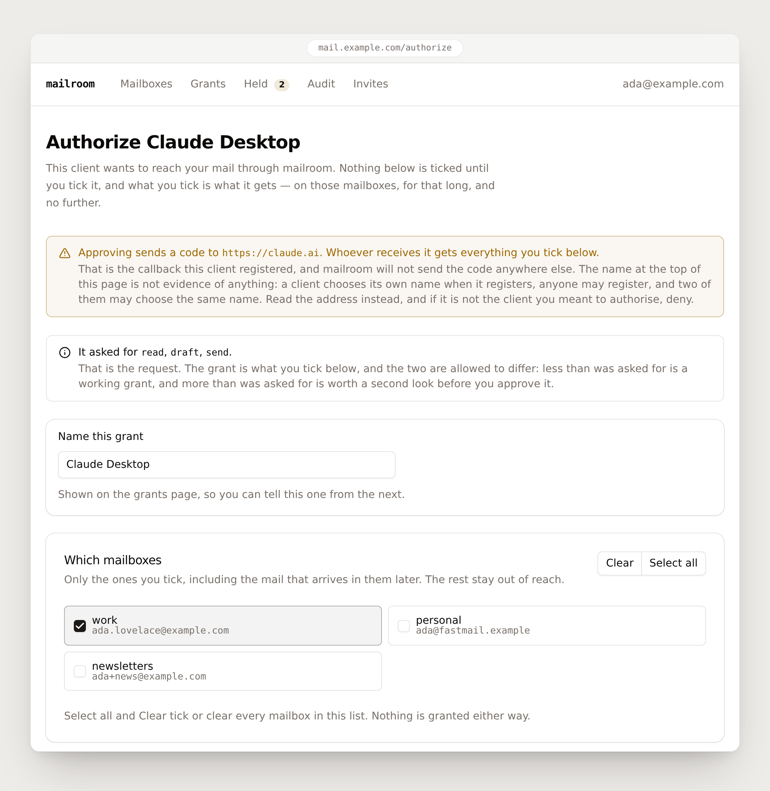
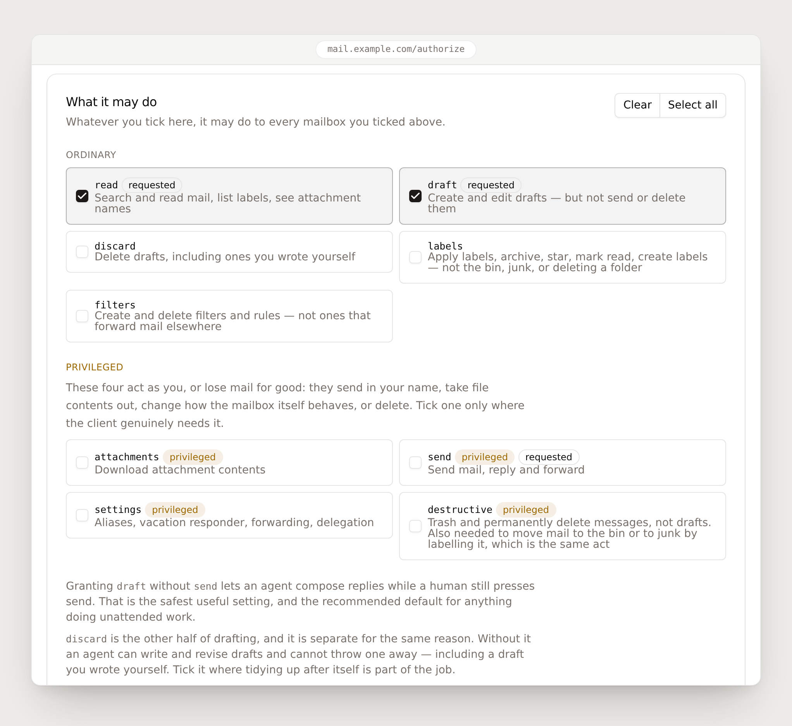
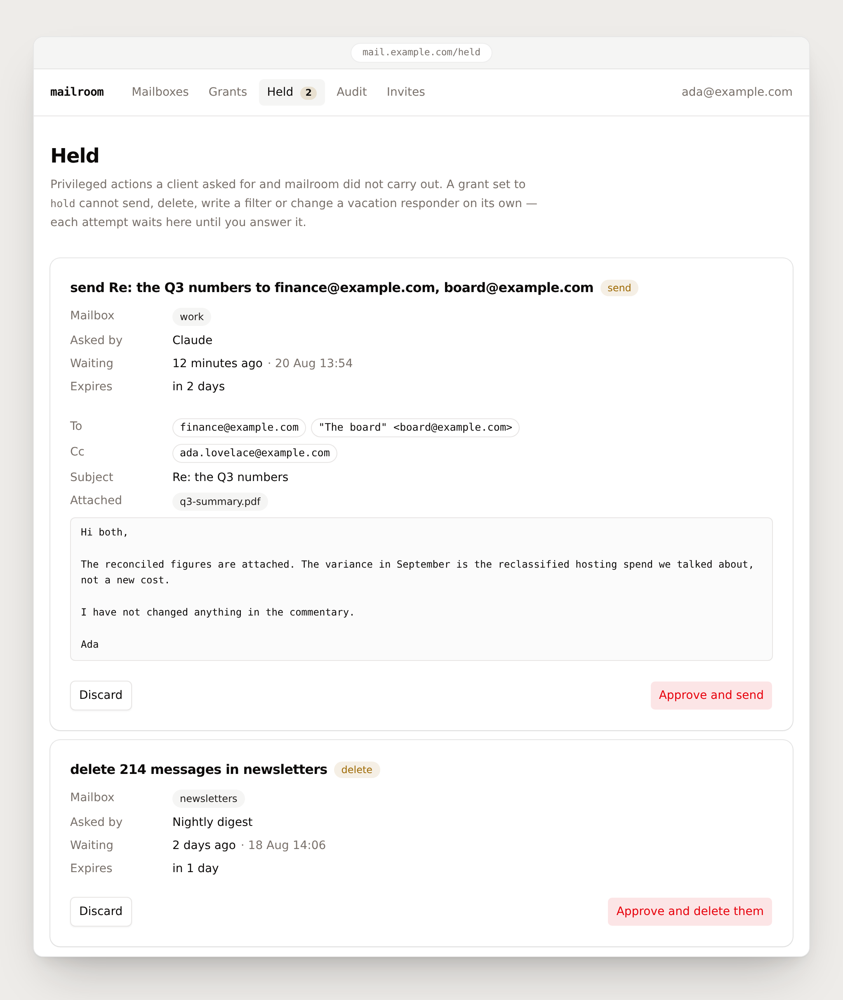
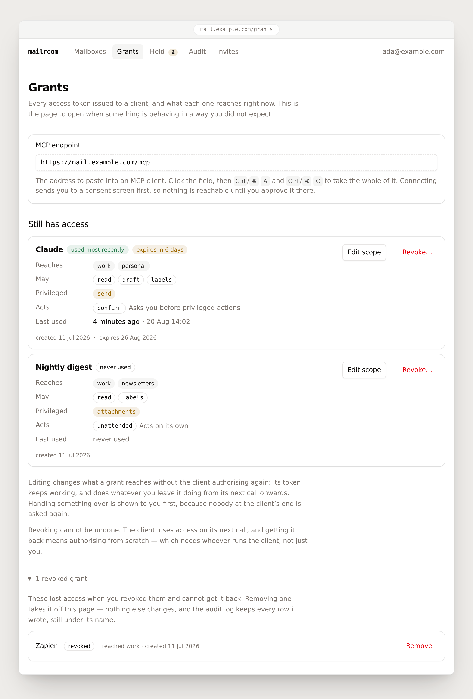
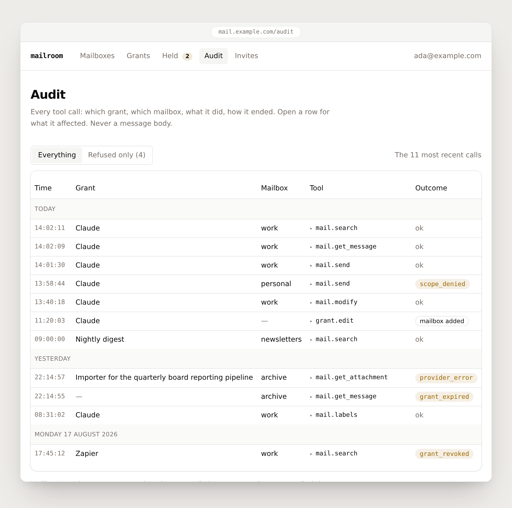
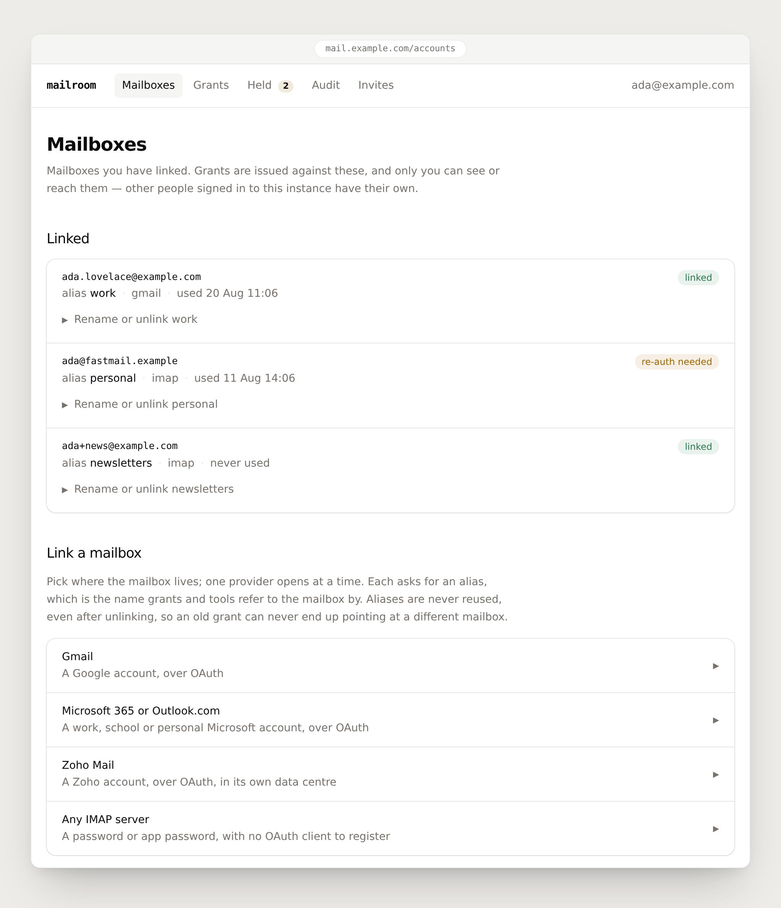

# mailroom

A self-hosted mail server for AI agents, speaking [MCP](https://modelcontextprotocol.io).
Many mailboxes, many providers, and every client connection a separately scoped grant.

A mailroom sorts everything that arrives and routes it to whoever should have it, and nobody
wanders in and helps themselves. That is the model here: the server holds your mail
credentials and hands out narrow, revocable, audited permission to use them.

<picture>
  <source media="(prefers-color-scheme: dark)" srcset="docs/images/consent-dark.png">
  
</picture>

**Approving a client.** Every MCP client that connects lands here before it reaches anything.
What it asked for is shown at the top; what it gets is what you tick, and the two are allowed
to differ. One mailbox is ticked here, so the other two stay out of reach — including the mail
that arrives in them tomorrow.

**Status: pre-alpha.** The server runs end to end against real Gmail: search, read, threads,
labels, drafts, attachments in both directions, and a real message sent and received — with
per-client scoped grants, per-grant behaviour modes and multi-user isolation. IMAP passes the
behavioural conformance suite on every CI run, against a server running in the same process,
so a regression there is caught by the next commit. **The other three pass that suite against
a real mailbox only when somebody runs it by hand** — Microsoft Graph on 22 August 2026, Zoho
on 24–25 August 2026, and Gmail on a date nobody wrote down. Nothing re-runs them and nothing
would notice one going stale, so read those as "it worked the last time it was tried" rather
than as coverage.
See [docs/providers.md](docs/providers.md#status) for exactly what is verified and what is
not, and [docs/roadmap.md](docs/roadmap.md) for the build order.

## Why

Every Gmail MCP server available today makes you choose between depth and multi-account support:

| Project | Depth | Multi-account | Health |
|---|---|---|---|
| Google's official Gmail MCP | 11 tools, no send/attachments/filters/settings | No | Developer preview |
| `GongRzhe/Gmail-MCP-Server` | 19 tools, deepest available | No | Archived Mar 2026 |
| `taylorwilsdon/google_workspace_mcp` | ~15 tools across all of Workspace | Per-user isolation | Active |
| `dmorrill/gmail-mcp-multi` | 13 tools, no threads/filters/attachments | Yes | 3 commits |

Surveyed August 2026, from each project's own repository; tool counts are the ones those
projects publish. Nothing re-checks it, so read the dates as the day somebody looked.

And none of them let you say *this agent may read one mailbox and draft, but never send.*
That last part is the reason mailroom exists.

## What it does

- **Every mailbox operation**, not a read-only subset — search, threads, drafts, send,
  labels, attachments, batch modify, filters, aliases and the vacation responder. What each
  provider actually supports differs, and
  [docs/providers.md](docs/providers.md#coverage) is the table to read before relying on one.
- **Multiple accounts in one connection.** `mail_search` takes an `account` alias, an address,
  or a list of either; omit it and the search fans out across every mailbox the grant allows,
  merged by date. Tools that take message ids route by the account named in the id.
- **Multiple providers behind one interface.** Gmail, Zoho, Microsoft 365 and Outlook.com
  through Microsoft Graph, and generic IMAP/SMTP — which is also how a mailbox is linked with
  a password rather than an OAuth round trip.
- **Per-client scoped grants.** Each MCP client gets a named grant naming exactly which
  accounts and which capabilities it may use, with an expiry, a one-click revoke, and a scope
  you can narrow afterwards without the client authorising again.
- **Three behaviour modes, one of which is enforced.** A grant acts `unattended`, `confirm` or
  `hold`. The first two are wording the client is told and is free to ignore, and mailroom says
  so on the screen where you choose. `hold` is the one this server enforces: under it a send, a
  delete, a filter change or a change to the vacation responder is recorded and **not
  performed**, and waits for you on a page inside mailroom that no MCP client can reach. See
  [docs/grants.md](docs/grants.md#modes).
- **Plugs into your existing identity.** Any OIDC issuer — Google, Authentik, Keycloak,
  Okta, Entra — or a forward-auth header from a proxy you already run, several at once. There
  is no built-in password: a mailbox gateway on the internet should not be one leaked string
  away from every credential it holds. Google needs no issuer configured and reuses the OAuth
  client you already registered for Gmail.
- **Multi-user.** Several people share one instance without sharing a mailbox: everything is
  owned, and nothing crosses between users. Signing in asks for no mail access at all;
  linking a mailbox is a separate, separately consented step.
- **Closed to strangers by default.** A new instance belongs to the first person who signs
  in and admits nobody else until you say so — by invite, by an address or domain allowlist,
  or to anyone your identity provider authenticates.

## What works where

Every provider is reached through one interface, and the interface does not pretend they are
the same. This is the short version; [docs/providers.md](docs/providers.md#coverage) is the
table to read before relying on any single row, and it explains each gap rather than scoring
it.

| | Gmail | Microsoft 365 / Outlook | Zoho Mail | IMAP / SMTP |
|---|:---:|:---:|:---:|:---:|
| Read and search | ● | ● | ● | ● |
| Threads | ● | ● | ◐ | ◐ |
| Free-text `query` in provider syntax | ● | ● | ● | ○ |
| Attachments | ● | ● | ● | ● |
| Drafts | ● | ● | ◐ | ○ |
| Send | ● | ◐ | ◐ | ● |
| Labels and folders | ● | ● | ● | ◐ |
| Trash and permanent delete | ● | ● | ◐ | ◐ |
| Filters and rules | ● | ◐ | ○ | ○ |
| Aliases and vacation responder | ● | ◐ | ◐ | ○ |

● works · ◐ works with a caveat · ○ not available

The caveats, in one line each, because a symbol is not an answer:

- **Threads** are native on Gmail and Graph and *derived* on Zoho and IMAP — neither reports a
  thread id on a listing, so grouping is inferred and says so.
- **`query`** is one argument aimed at four grammars. IMAP has none: RFC 3501's `TEXT` is a
  substring of the raw message, so `from:alice is:unread` searches for that literal string,
  finds nothing, and succeeds. Use the structured fields when a search spans providers.
- **Drafts** on Zoho save, list and discard, but cannot be edited, sent, or made to answer a
  message: Zoho's API has no call that rewrites a stored draft or puts one on the wire, and its
  save-draft endpoint refuses the fields that record what a reply replies to. Each is refused
  by name rather than worked around, because every workaround changes what was asked for
  without being able to say so.
- **Send** puts attachments in Zoho's own upload store before composing, so a Zoho message
  carries files like any other; Graph carries up to 3 MB of them inside the message itself.
- **Labels** are folders on IMAP, so they are exclusive and a message lives in exactly one.
- **Trash** restores to the inbox rather than to wherever mail was filed before, on Zoho and
  Graph alike; neither records the original folder. On Zoho, trashing also spends the id the
  caller was holding, because an id there names a folder.
- **Filters** are work/school only on Graph — a consumer mailbox has no message rules — and
  Zoho publishes no filters API at all, so its ○ is a limit of the API rather than something
  waiting to be written. No provider will create a filter that forwards mail elsewhere.
- **Vacation** has no subject on Graph, and Graph reports addresses rather than send-as
  entries. On Zoho it can be read and switched off but not switched on: Zoho requires a start
  and end date on every auto-reply and mailroom's settings carry none, so it refuses rather
  than deciding for you when yours stops answering.

What a mailbox can actually do is also visible at runtime: `mail_accounts` reports each
linked mailbox's capabilities and quirks, so a client discovers a gap rather than guessing at
one.

## What it looks like

One operator interface, and every screen below is a real render of the real templates — the
mailboxes in them are invented, nothing else is.

<picture>
  <source media="(prefers-color-scheme: dark)" srcset="docs/images/capabilities-dark.png">
  
</picture>

**Nine capabilities, each its own decision.** `read` and `draft` are ticked and `send` is not,
which is the grant this README opened by describing: the agent may compose the reply, and a
person still presses send. The four that act as you or lose mail for good — `send`,
`attachments`, `settings`, `destructive` — are grouped apart and marked, so granting one is
never something you do by running down a list. `discard` is separate from `draft` for the same
reason: writing a draft and destroying one are not the same permission.

<picture>
  <source media="(prefers-color-scheme: dark)" srcset="docs/images/held-dark.png">
  
</picture>

**What `hold` produces.** A client under a `hold` grant asked to send this, and mailroom did
not send it. The message is on the page in full — recipients, subject, attachment, body —
because a decision about a message you cannot read is not a decision. Approving carries out
exactly what was queued; discarding throws it away and does not tell the client. This is the
only screen in the product where pressing a button sends somebody's mail.

<picture>
  <source media="(prefers-color-scheme: dark)" srcset="docs/images/grants-dark.png">
  
</picture>

**Every token issued, and what it reaches right now.** Two clients, deliberately unequal: one
may send, is told to ask first, and expires in six days; the other reads and labels, may take
attachment contents out, and acts on its own. A revoked grant is still listed, because knowing
what once had access is part of knowing what has it now. Nothing on this page needs the
client's cooperation — revoking ends its access on its next call, and narrowing a scope takes
effect without it authorising again.

<picture>
  <source media="(prefers-color-scheme: dark)" srcset="docs/images/audit-dark.png">
  
</picture>

**Every call, and especially the ones that did not go through.** `scope_denied` on a
`mail.send` is the whole model working: a client asked to send from a mailbox its grant covers
for reading, and was told no — and the attempt is on the record either way, beside an expired
grant, a revoked one and a mailbox that failed. A row names what a call affected and, for
outgoing mail, where it went. It never holds what was in a mailbox.

<picture>
  <source media="(prefers-color-scheme: dark)" srcset="docs/images/mailboxes-dark.png">
  
</picture>

**Several mailboxes, more than one provider, one connection.** A grant is issued against these,
and a client holding one never sees the rest. The mailboxes linked here happen to be Gmail and
IMAP, but all four providers have been run against a real mailbox — see
[the status table](docs/providers.md#status) for when each was last tried, since three of the
four are only ever tried by hand.

These are generated, not collected: `node scripts/readme-shots.mjs` renders each page state
through the server's own template path, frames it with `scripts/readme-shots.css`, and
screenshots the result — so a change to the UI is one command away from being a change to the
pictures. Every state of every page, light and dark, including the ones nobody would put in a
README, is in [docs/ui/screenshots](docs/ui/screenshots).

## Quickstart

```sh
docker run -p 127.0.0.1:8080:8080 \
  -v ./data:/data \
  -e MAILROOM_ENCRYPTION_KEY="$(openssl rand -base64 32)" \
  -e MAILROOM_PUBLIC_URL="https://mail.example.com" \
  -e MAILROOM_AUTH_PROVIDERS="google" \
  -e MAILROOM_GOOGLE_CLIENT_ID="..." \
  -e MAILROOM_GOOGLE_CLIENT_SECRET="..." \
  ghcr.io/tfyl/mailroom:main
```

The port is published on loopback because `MAILROOM_PUBLIC_URL` is an HTTPS address, so
something else terminates TLS in front and reaches it there. Publishing on every interface
would leave the plaintext port reachable beside it, and `-p` writes its rules ahead of most
host firewalls. Widen it when you mean to — [Deploying](docs/deploying.md#minimum) says when
that is right, and `deploy/docker-compose.yml` binds the same way.

`:main` is what exists today. It moves on every merge, which is the wrong property for a
server holding live mailbox credentials — pin a digest for anything you rely on:

```sh
docker pull ghcr.io/tfyl/mailroom:main
docker inspect --format '{{index .RepoDigests 0}}' ghcr.io/tfyl/mailroom:main
```

There is no `:latest`. It is published only by a `v*` tag and this project has cut no release,
so a compose file naming it fails at pull time rather than starting something old.

That is the whole dependency list, and it is also the limit: one replica. State is one SQLite
file in `/data` and sessions are held in this process, so a second replica would see neither.
`MAILROOM_DB` accepts `sqlite://` and nothing else — there are no Postgres or Redis adapters,
and setting `MAILROOM_REDIS` only logs a warning saying so. See
[Scaling out](docs/deploying.md#scaling-out).

The Google client is the same one that links a Gmail mailbox, so signing in with Google costs
no extra credentials — but its login callback is a separate path from the linking one and has
to be registered too, which is the one step people miss. `scripts/setup.sh` drives the rest of
the Google path, with `gcloud` and `terraform`, and stops at the Console steps Google publishes
no API for: creating the client, and registering both of its redirect URIs. It prints exactly
what to click.

Outlook and Microsoft 365 need an Entra app registration, and that one is wholly scriptable:
`deploy/terraform/microsoft` creates the registration, its redirect URI and the five delegated
Graph permissions in a single apply, with no portal step at the end. It resolves the
permissions by name rather than by GUID, which is the part that is easy to get silently wrong
by hand. What it cannot conjure is a directory to create it in — a personal Microsoft account
belongs to Microsoft's shared consumer tenant, which cannot hold a registration at all, so an
account with no directory of its own needs one first. That is free and takes a minute; the
README there covers it.

Then open the UI, sign in, link a mailbox, and point an MCP client at
`https://mail.example.com/mcp`.
The client registers itself, you approve a grant, and it gets a token scoped to exactly what
you ticked.

A mailbox can also be attached over IMAP, from a form on the same page or with
`mailroom link-imap` on the host. With a Gmail app password that is the only route to a
working mailbox that touches no OAuth client, no consent screen and no Google Cloud Console —
the one path a deployment can finish unattended, and the only one at all for a mail host that
does no OAuth. It costs something: see
[Linking a mailbox without an OAuth client](docs/deploying.md#linking-a-mailbox-without-an-oauth-client).

Your first sign-in claims the instance, and nobody else can create an account until you choose
a signup policy — see [Signups](docs/deploying.md#signups).

**Keep `MAILROOM_ENCRYPTION_KEY` safe and backed up.** It seals your stored provider refresh
tokens. Losing it means re-linking every mailbox. The server refuses to start without it
rather than silently generating one you would lose on the next redeploy.

## Documentation

- [Architecture](docs/architecture.md) — how it is put together and why
- [Grants](docs/grants.md) — the scope model and consent flow
- [Tools](docs/tools.md) — the MCP contract: discovery, aggregation, errors
- [Providers](docs/providers.md) — the provider contract, and how to add one
- [Deploying](docs/deploying.md) — configuration, identity modes, reverse proxies
- [Security](docs/security.md) — threat model and the controls that are not optional
- [Operator interface](docs/ui.md) — the design system, and the one hand-written script
  every page is built to work without
- [Roadmap](docs/roadmap.md) — build order

## Tools

| Tool | Covers | Requires |
|---|---|---|
| `mail_search` | Query one or many accounts, paginated | `read` |
| `mail_get_message` | Full body, headers, attachment manifest | `read` |
| `mail_get_thread` | Whole conversation in order | `read` |
| `mail_get_attachment` | A signed download URL — or a small text file inline, if you ask | `attachments` |
| `mail_draft` | Create, update, or reply-draft, with attachments | `draft` |
| `mail_draft` | Delete a draft | `discard` |
| `mail_send` | Send new, reply, forward, or an existing draft, with attachments | `send` |
| `mail_modify` | Label, archive, read state, star — single or batch | `labels`, plus `destructive` for a label that bins or junks |
| `mail_trash` | Trash, untrash, permanent delete | `destructive` |
| `mail_labels` | `action: list \| create \| delete` | `read` / `labels` |
| `mail_filters` | `action: list \| create \| delete` | `filters` |
| `mail_settings` | `action: aliases \| vacation \| set_vacation \| forwarding \| delegates \| imap` | `settings` |
| `mail_upload_url` | A signed URL to upload a file to attach | `draft` / `send` |
| `mail_accounts` | Which mailboxes this grant reaches, and what they support | — |

Everyday operations are their own tool. The administrative tail collapses behind an `action`
parameter, so full coverage does not cost the client forty tool definitions of context.

Under a grant in `hold` mode, four of those rows do not do what they say. `mail_send`,
`mail_trash` (trashing and deleting, never untrashing), `mail_filters` and the vacation
responder on `mail_settings` record the request, tell the client plainly that nothing happened,
and wait for a person. `mail_accounts` says which
mode the grant is in and which tools it holds, so a client can find that out before it tries.

## A warning worth reading

Anyone can put text in your inbox. That makes every message body untrusted input aimed
directly at an agent holding your mail credentials — prompt injection here is not theoretical.

Nothing is ticked for you on the consent screen — not even what the client asked for — and
`draft` without `send` is the grant to reach for, which is the case that screen puts to you
rather than a default it applies behind you. Retrieved content is marked untrusted at the tool
boundary, outbound send is rate-limited per grant, and a grant in `hold` mode cannot send at
all until you press the button yourself. Read [docs/security.md](docs/security.md) before
granting `send` to anything.

## License

[AGPL-3.0](LICENSE), copyright 2026 [tfyl](https://github.com/tfyl) — see [COPYRIGHT](COPYRIGHT).

Section 13 is why. If you run a modified mailroom as a network service, and running it as a
network service is the only way anybody runs it, you must offer your users the source of your
modified version.
