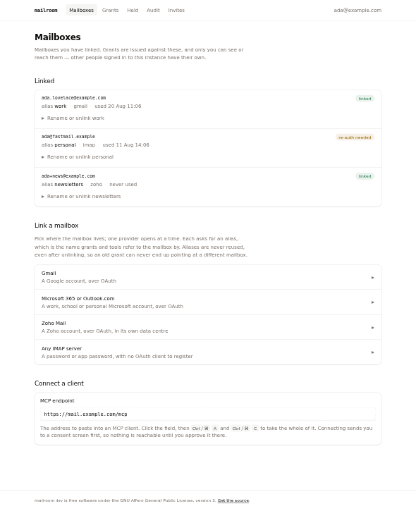
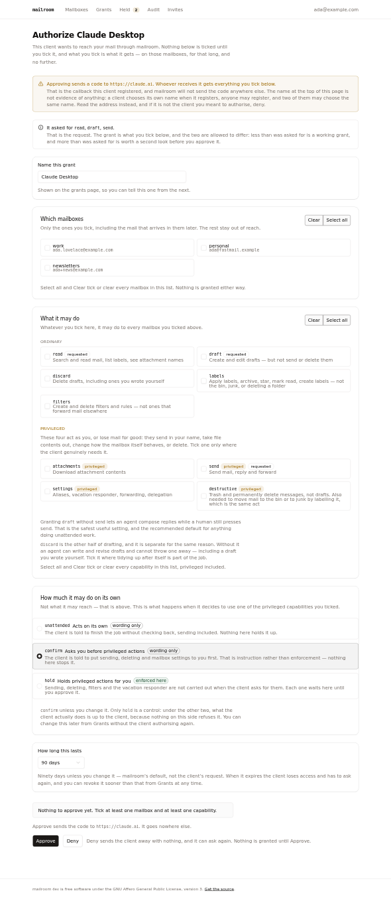

# The operator interface

The web UI is server-rendered `html/template`, embedded with `embed.FS`, styled with
[Basecoat](https://basecoatui.com) — shadcn/ui's components and themes written as plain HTML
and Tailwind classes rather than as React. This page is the convention: read it before adding
a page or a component.

## The rule that shapes everything else

**Every page works with JavaScript switched off, and script may only make a page that already
works faster or clearer.** That is the whole rule, and it is stricter than it sounds.

The policy served with every page is:

```
default-src 'none'; script-src 'self'; style-src 'self'; img-src data:; form-action …;
frame-ancestors 'none'; base-uri 'none'
```

`script-src 'self'` was absent until this UI had a script at all, and what it does not say is
the point of it: no `'unsafe-inline'`, no `'unsafe-eval'`, no origin but this one. An injected
`<script>` block or an `on*` attribute is still dead markup — it never runs — and there is no
CDN in the trusted set to compromise. `internal/web/confirm_test.go` fails the build on a
`<script>` with a body, on a script with no `src`, on an `on*=` attribute and on a
`javascript:` URL in any template; `internal/web/stylesheet_test.go` fails it on a `style=`
attribute, which is what lets `style-src` be `'self'` rather than `'unsafe-inline'`.

This is not asceticism. The most important screen in the product is the consent screen, where
an operator decides what a client may do with their mail, and the value of a policy that can
say "one script from here, no inline anything, no framing, no outbound anything" is that an
injection which reached the page still cannot rewrite what the buttons appear to do. On that
screen progressive enhancement is a security property rather than a courtesy: a control that
looks ticked and submits something else is not a degraded experience, it is a vulnerability.
So the enhanced control is the plain one — a real submit button, posting to a real endpoint —
and the script intervenes in front of it.

**Basecoat ships JavaScript for its interactive components. Do not use any of it, and do not
add it to the repository.** `scripts/vendor-basecoat.sh` does not even fetch it: the vendored
copy under `internal/web/assets/basecoat` contains only components that are CSS alone. Our own
script is 200 lines we can read; a component framework's is not, and a dialog, a dropdown menu,
a combobox, a select, a tab strip or a toast all have an answer here that needs no script at
all — a page, a form, a `<details>`, or a native control. Reach for those first.

## How the stylesheet is built

```
internal/web/assets/
  app.css              the entry point: the import allowlist
  theme.css            the design tokens, light and dark
  mailroom.css         the product's own components
  basecoat/            vendored, do not edit
internal/web/static/
  app.css              generated, committed, embedded, served
```

`internal/web/static/app.css` is **generated and committed**. That is deliberate:

- `go:embed` needs the file to exist at compile time, so a clone that had to run a CSS build
  before `go build ./...` worked would be a clone that does not build. `git clone && go build`
  has to keep working for somebody who has never heard of Tailwind.
- The release image cross-compiles in a single Go stage and takes under three minutes. A CSS
  build stage would put a hundred-megabyte download and a second toolchain in front of every
  release, for a file that changes a handful of times a year.
- The runtime image is distroless and the binary is the whole deployment. Nothing about Node
  should be able to leak into either.

To change it:

```sh
make css          # rebuild internal/web/static/app.css — commit the result
make vendor-css   # refresh the vendored Basecoat, then rebuild
make css-check    # what CI runs: fails if the committed file is stale
```

`make css` downloads the Tailwind **standalone binary** into `.tools/` (gitignored) on first
use. It carries its own runtime, so there is no `package.json`, no `node_modules`, no lockfile
and nothing installed outside the checkout. Commit the rebuilt `static/app.css` in the same
commit as the change that caused it; CI fails otherwise.

That download is checked against `tailwind.sha256` before it is made executable, so a replaced
release asset or a moved tag stops the build rather than running on the machine of everybody
who touches a template. `TAILWIND_VERSION` in the `Makefile` and the rows in that file are one
pin kept in two places: bump the version and the build refuses to proceed until the new
release's `sha256sums.txt` has been recorded alongside it.

The stylesheet is served from `/static/app.<digest>.css`, with the digest of its own contents
in the name. That is what makes a one-year `immutable` cache safe, and it is why the route is
registered outside the authentication guard — the sign-in page is served to somebody with no
session and still has to be able to style itself.

## The script

```
internal/web/static/
  app.css              generated by `make css`, committed, embedded, served
  app.js               written by hand, committed, embedded, served — byte for byte
```

One file, no build step, no bundler, no `package.json`, no `node_modules`. What is in the
repository is what the browser executes, which is why it can be read in one sitting and why
`git clone && go build` still needs nothing but Go. It is served from
`/static/app.<digest>.js` with the digest of its own contents in the name, registered outside
the authentication guard beside the stylesheet, with `text/javascript; charset=utf-8` and a
one-year `immutable` cache — the same arrangement as `app.css`, for the same reasons.
`internal/web/assets.go` has both, side by side.

`layout.html` links it on every page:

```html
<script src="{{.Script}}" defer></script>
```

Most pages use none of it. That is the intended state, not a transitional one.

### The enhancement pattern

An enhancement is a function registered under a name. It runs once for each element carrying
`data-enhance="<name>"`, after `DOMContentLoaded`:

```js
const enhancements = {
  consent: consentForm,
};
```

```html
<form method="post" action="/authorize/approve" data-enhance="consent">
```

A page with no `data-enhance` attribute costs one empty `querySelectorAll` and behaves exactly
as it did before there was a script. To add one: write the function, register it, put the
attribute on the element it applies to. Do not add a second script file, a second `<script>`
tag, or a listener that hunts for a page by URL.

There is one shared idiom besides the registry. Copy that is only true while the script is
running — "sends the page back to be redrawn", which is what an enhancement stops doing — is
written for the no-script case and swapped in place:

```html
<span data-js-text="Ticks or clears every box in this list.">
  Sends the page back to be redrawn with the ticks changed.
</span>
```

### What an enhancement may do

- **Enhance a control that already works.** The select-all buttons on the consent screen are
  submit buttons with `formaction="/authorize/reselect"`, and `Reselect` re-derives everything
  from the signed-in operator's own mailboxes. The script listens for `submit`, reads
  `event.submitter`, and ticks the boxes itself. A browser that reports no submitter, or a
  value the script does not recognise, falls through and posts — so the round trip is the
  floor, not the fallback nobody tested.
- **Show something that cannot exist without it.** The running summary above Approve is
  computed from the checkboxes on every change. It is `hidden` in the markup and unhidden by
  the script, deliberately: a summary the server rendered would be right until the next tick,
  and a line reading "read only" above boxes that now say `send` is worse than no line at all.
  If you cannot keep a piece of state honest on every change, do not render it.
- **Toggle attributes and classes that already appear in a template.** Tailwind scans
  `internal/web/templates/*.html` and nothing else, so a utility named only in the script was
  never built and does nothing. Write `data-[privileged=yes]:bg-warning/10` on the element in
  the template and set `dataset.privileged` from the script.

### What it may not do

- **No inline anything.** No `<script>` with a body, no `on*=` attribute, no `javascript:`
  URL, no `eval`, no `new Function`, no dynamic import. The policy has no `'unsafe-inline'`
  and no `'unsafe-eval'` to fall back on, and the test above fails the build.
- **No writing markup.** `textContent`, `checked`, `hidden`, `dataset` — never `innerHTML`.
  Half of what is on the consent screen is a name an unauthenticated client registration
  chose, and `html/template` is what makes that safe.
- **No deciding anything.** The server decides. A script that ticks boxes cannot widen a
  grant; a script that submitted one could.
- **No dependency.** Nothing fetched, nothing vendored, nothing from a CDN — `script-src` has
  one source and it is `'self'`.

### Proving it

Two kinds of test, and a feature needs both:

- The no-script path, driven through the real handlers — `internal/web/consent_test.go` posts
  to `/authorize/reselect` and approves afterwards, which is what the enhancement must not
  quietly become the only version of.
- The markup the no-script path depends on: that each select-all is still a submit button with
  its `formaction`, that the server accepts every value the page offers, that the script and
  the server name the same selections, and that the script-only summary renders `hidden` and
  empty. Those live beside the round-trip tests.

`internal/web/script_test.go` covers the route itself: served, typed, digest-addressed,
reachable without a session, and linked exactly once by every page.

## The palette

shadcn/ui's **stone** base colour. Stone's greys carry a trace of warmth, which is what the
hand-written stylesheet this replaced was already reaching for; slate's blue cast reads as
dashboard chrome and zinc's as developer tooling, and this is neither. The palette is
otherwise achromatic, so the two colours that do appear carry.

Tokens live in `internal/web/assets/theme.css` and are the full shadcn set — `background`,
`foreground`, `card`, `muted`, `border`, `input`, `ring`, `primary`, `secondary`, `accent`,
`destructive`, `radius` — plus two of our own:

| token       | means                                                            |
| ----------- | ---------------------------------------------------------------- |
| `--success` | a mailbox is linked and working                                   |
| `--warning` | something needs attention but is not broken: `re-auth needed`, `privileged`, `expired` |

Dark mode is driven by `prefers-color-scheme`, not by a class on `<html>`. Basecoat's default
`dark` variant is `&:is(html.dark *)` — a class only a script would ever set — so `theme.css`
redefines the variant as a media query. Both palettes ship in the one file and the browser
chooses; there is no theme switcher and there cannot be one without script.

**Colour never carries meaning on its own.** A status badge says `linked` or `re-auth needed`
in words; the colour only makes it findable.

Two marks — the tick inside a checkbox and the chevron on a select — are SVG data URIs, which
is why `img-src data:` is in the policy. They are percent-encoded and their colours are hex
rather than `oklch()`, and both of those matter: a raw `<` does not survive minification, and
an SVG rendered as an image does not know `oklch()`. Either mistake leaves a checkbox that
still looks ticked and has no tick. `theme.css` says so at the point it would be undone.

## What it looks like

Every page in every state it can be in, light and dark, lives in
[`ui/screenshots/`](ui/screenshots):

- [`contact-sheet-light.png`](ui/screenshots/contact-sheet-light.png) and
  [`contact-sheet-dark.png`](ui/screenshots/contact-sheet-dark.png) — the whole product on one
  page, grouped by section. This is the one to open when the question is whether a change fits
  the rest of the UI, because the failure mode this design system actually has is a page that
  is coherent on its own and belongs to nothing.
- [`pages/`](ui/screenshots/pages) — one render per state per theme, at 1180 px, named
  `<state>-<theme>.png`.
- [`narrow/`](ui/screenshots/narrow) — the same pages at 420 px, where the layouts break.
- [`before/`](ui/screenshots/before) — the pages before the ergonomics pass that produced the
  current ones, kept as the comparison that change is argued from, not as a target.

They are generated rather than collected, so they can be regenerated after a change instead of
drifting out of date one page at a time:

```sh
make ui-shots                         # the whole set: pages/, narrow/, both contact sheets
node scripts/ui-shots.mjs consent     # or just the states named, sheets left alone
CHROME=/path/to/chrome make ui-shots  # if Chrome is somewhere the script does not look
```

That is the whole command. It wants Node and a Chrome, and neither is needed to build or run
mailroom, which is why it is a target rather than a step in anything — but nothing else is
needed, and in particular there is no `package.json`, no `node_modules` and no
browser-automation library. `scripts/ui-shots.mjs` runs the Go half itself into a temporary
directory and drives Chrome over the DevTools protocol with Node's own WebSocket.
`make readme-shots` is its sibling and rebuilds the pictures in `README.md` the same way.

It writes into `pages/`, `narrow/` and the two contact sheets, and nowhere else. `before/` and
`fixes/` are history — the pre-ergonomics-pass comparison and annotated one-off shots — and
regenerating either would destroy the only copy of the thing being compared against.

Both themes come from `Emulation.setEmulatedMedia`, not from a class on `<html>`: the palette
is chosen by `prefers-color-scheme` and there is no switch to click, so emulating the media
query is the only way to ask for the dark render, and it is the same signal a real browser
sends.

The Go half can be run on its own when what you want is the markup rather than the pictures:

```sh
SHOTS_DIR=/tmp/mailroom-ui go test -tags shots ./internal/web -run TestShots
```

`internal/web/shots_test.go` is behind a build tag and holds the fixture for each state — an
expired grant, two grants with the same name, a rejected IMAP password, a 64-character alias.
It renders the real templates through the real `render` and writes standalone HTML beside a
copy of the stylesheet and the script. Adding a state means adding a case to that file, and
then naming it in a section of `SECTIONS` in `scripts/ui-shots.mjs` — a state the sheet does
not claim fails the run rather than being quietly left off, because the sheet's whole claim is
that it is everything. **A state that is not in `shots_test.go` is a state nobody has looked
at**, which is how `invites.html` spent a release rendering entirely unstyled.



The held queue — `pages/held-light.png` and its dark twin — is the other page worth opening,
because it is the only screen in the product where pressing a button sends somebody's mail.
The message is on the page in full so it can be read before it is agreed to, and the two
controls are arranged the way the widen page arranges its: the escape first, the irreversible
act at the far end. `pages/held-open-light.png` is that page with the closed-actions list
disclosed, which is where an action goes once it is answered — and where it goes when nobody
answers it and its message is discarded. Like `audit-open`, it is derived by opening a
`<details>` rather than rendered from data of its own, because no handler forces that one
open either.

The consent screen is the one to read closely, because it is where the vocabulary and the
progressive-enhancement rule meet: `pages/consent-light.png` and `pages/consent-dark.png` are
the page as served, `pages/consent-privileged-light.png` is the same page with two privileged
capabilities ticked — the rows tint without script, the summary above Approve needs it — and
`pages/consent-nojs-light.png` is what a browser with the script blocked gets.



The audit page has two: `pages/audit-light.png` is the page as served, which is the state it
is designed for — a table scanned down its columns for the one row that is not ordinary — and
`pages/audit-open-light.png` is every row disclosed at once, which is where the detail each row
carries actually lives. The second is derived from the first rather than rendered from data of
its own: `<details>` opens without script, so it is a state a reader reaches by clicking and
not one any handler decides.

## The component vocabulary

| you want             | write                                                        |
| -------------------- | ------------------------------------------------------------ |
| primary button       | `<button class="btn">Link Gmail</button>`                     |
| secondary button     | `<button class="btn" data-variant="outline">Rename</button>`  |
| destructive button   | `<button class="btn" data-variant="destructive">Unlink</button>` — a tint, because it sits among other controls |
| the button that performs the irreversible act | the same, inside `.decision`, where it is filled |
| link that acts as a button | `<a class="btn" data-variant="outline" href="…">Cancel</a>` |
| panel                | `<div class="card"><section>…</section></div>`                |
| compact panel        | `<div class="card" data-size="sm"><section>…</section></div>` |
| status pill          | `<span class="badge" data-variant="success\|warning\|outline\|destructive">…</span>` |
| notice               | `<div class="alert">{{template "iconInfo"}}<strong>Title.</strong><section><p>…</p></section></div>` |
| failure              | the same with `data-variant="destructive" role="alert"` and `{{template "iconAlert"}}` |
| something that needs attention and has not gone wrong | the same with `data-variant="warning"` and `{{template "iconAlert"}}`, and no `role` |
| labelled input       | `<div class="field"><label for="x">…</label><input type="text" id="x" name="x"><p>help</p></div>` |
| checkbox             | a `<label>` inside a `.field`, with the `<input type="checkbox">` first |
| a checkbox that makes things *less* safe | add `data-variant="destructive"` to that `<label>` |
| a checkbox for a privileged capability | add `data-variant="warning"` to that `<label>` |
| a group of them      | a `<fieldset class="fieldset">` with an `sr-only` `<legend>`, around a `role="group"` or `role="radiogroup"` |
| a scope, as facts    | `<dl class="facts"><dt>Reaches</dt><dd>…badges…</dd></dl>` |
| the footer of an irreversible question | `<div class="decision">` — escapes first, the destructive button at the far end |
| a value shown once, to be copied | a readonly `<input>` inside `.copyable`, as `.endpoint` does |
| table                | `<table class="table">` inside `<section class="table-container">` |
| inline literal       | `<span class="mono">MAILROOM_PUBLIC_URL</span>`               |
| an alias, an address or a grant label | whatever it is, plus `wrap-anywhere` — see "Text somebody else chose" |
| body copy            | `<p class="prose">`, or `<p class="lede">` for the one under an `<h1>` |
| a list of sibling rows | one `<ul class="stack">` or `<div class="stack">`, not a card each |
| a disclosure         | `<details class="advanced"><summary>…</summary>…</details>`   |
| one-of-several disclosures | give each `<details name="…">`; the browser closes the others |
| a choice that opens a form | `.stack.chooser` of `<details>`, each `<summary>` a `.choice` |
| a destructive action | a `.danger` block, with a `required` checkbox above its button |
| a key to press       | `<kbd class="kbd">Ctrl</kbd>`                                 |
| an enhanced control  | the plain control, plus `data-enhance="name"` on its container — see "The script" |
| copy that changes when the script runs | `data-js-text="…"` on the element holding the no-script wording |

`<h1>`, `<h2>` and `<h3>` are styled as elements — no class needed. Layout is Tailwind
utilities (`flex`, `gap-4`, `max-w-2xl`); anything reusable belongs in `mailroom.css`.

`internal/web/templates/accounts.html` is the reference implementation. It exercises cards,
badges, alerts, fields, the row list, the provider chooser, the destructive block, the readonly
endpoint input and the empty state, so copy its shapes rather than inventing new ones.

Two habits that page is worth reading for, both of which cost nothing and are easy to leave
out. A rejected value comes back to the field it was typed into — `data-invalid` on the
`.field`, `aria-invalid` on the input, and a `<p role="alert">` between the input and its help
— rather than as a banner at the top that the reader has to match back to a form by eye. And
anything rare or dangerous sits behind a `<details>` that the handler can force open, so the
default view is what somebody came to do and a correction is never hidden behind a closed
summary.

## Adding a page

1. Write `internal/web/templates/<name>.html` defining `{{define "content"}}`. The shell,
   the header, the nav and the stylesheet link come from `layout.html`.
2. Add `<name>` to the list in `internal/web/web.go` (`New`, around line 76). Every page is
   parsed together with `layout.html` and `mcp_endpoint.html`.
3. Register the route in `Server.Routes`. Everything goes behind `guard(…)` unless it is
   reachable before sign-in, and every `<form>` carries
   `<input type="hidden" name="csrf_token" value="{{.CSRF}}">` — `TestFormsCarryTheCSRFFieldNameThatIsChecked`
   counts forms against fields.
4. Run `make css`. Tailwind only emits the utilities it finds used, so a class you added to a
   template changes the built stylesheet. Commit it.
5. Nothing to do for the script: `layout.html` links it already. If the page wants an
   enhancement, read "The script" first — the control has to work before it is enhanced.

## Adding a Basecoat component

1. Check it works without JavaScript. If `basecoat.js` implements its behaviour, stop.
2. Add its name to `COMPONENTS` in `scripts/vendor-basecoat.sh`.
3. `make vendor-css`, then add the matching `@import` lines to `internal/web/assets/app.css`.
4. Commit the vendored CSS and the rebuilt stylesheet together.

## The transitional layer, and its removal

`internal/web/assets/legacy.css` held the vocabulary of the hand-written stylesheet this
design system replaced — `.note`, `.row`, `.muted`, `.check`, `form.inline` and a padding shim
for cards whose content was not wrapped in a `<section>`. It existed so that a page not yet
reworked did not render as unstyled markup, and for no other reason.

**Every page is converted, so the file and its `@import` are gone.** Nothing should bring any
of those names back. A page that needs a notice writes an `.alert`, one that needs a panel
writes a `.card` with a `<section>` inside it, and muted text is `text-muted-foreground` — all
of which are in the table above.

## Text somebody else chose

Four of the strings on these pages are not ours. An **alias** is `[a-zA-Z0-9_-]{1,64}` — sixty
four characters with, by construction, nowhere to break. An **address** comes from a mail
provider. A **grant label** and a **client name** are whatever an unauthenticated client
registration sent. Every one of them lands in a card, a badge, a `<summary>` or a button, and
tidy fixtures are `work`, `personal` and `Claude`, so none of it ever shows up while the page
is being written.

Give any of them **`wrap-anywhere`**, or the CSS rule that covers where they land. There is no
third option that is not a defect: the panels here either clip (`.stack` and `.card` both
hide their overflow, so the name is cut mid-word with nothing to say it was) or they do not,
and then one long name puts a horizontal scrollbar on the whole page at 420 px. `overflow-wrap:
anywhere` rather than `break-all` because it only breaks the word that would not otherwise fit,
so an ordinary name is set exactly as it was before.

The fixtures in `shots_test.go` carry a 54-character alias, a 91-character address and a
54-character grant label for this reason, and they are the states worth looking at first after
a change to any page that names a mailbox.

## Accessibility

Not optional, and cheap here because the markup is plain HTML.

- Every input has a real `<label for>`, or an `aria-label` where the label would be visual
  noise (the inline rename field).
- The current nav item is marked with `aria-current="page"`; the highlight hangs off that
  attribute rather than off a second class, so the two cannot disagree.
- `:focus-visible` draws a two-pixel ring in the `ring` colour. Keep it. Two adjacent buttons
  on a mailbox row are `Rename` and `Unlink`, and a keyboard user has to know which is about
  to be pressed.
- Both palettes clear 4.5:1 for body text. If you add a colour, check it in both.
- `--muted-foreground` on `--muted` is 4.4:1 in the light theme, which is the one pairing in
  shadcn's stone that does not clear it. Text on a muted chip — the grant id, a keycap — is
  `text-foreground/75` instead. Both of those are read character by character, which is the
  worst thing for the lowest-contrast text on the page to be.
- Errors carry `role="alert"`.
- The shell starts with a skip link to `#content`.
